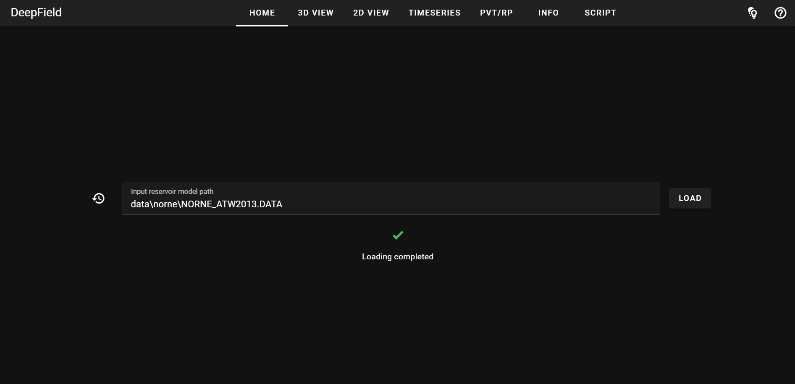
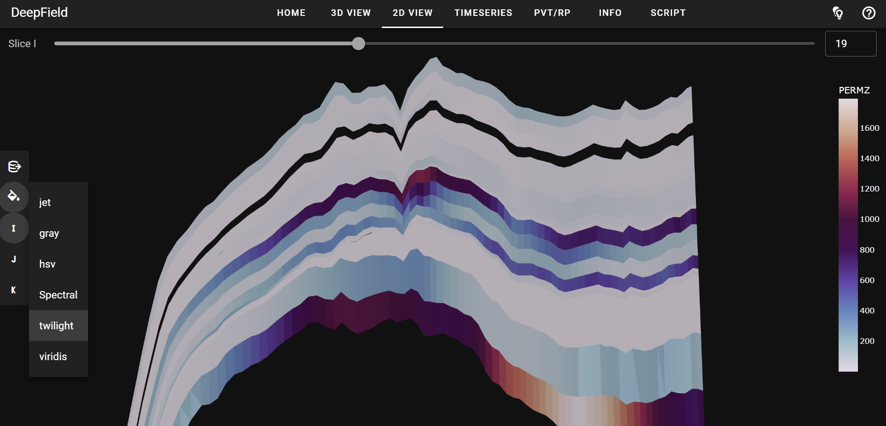
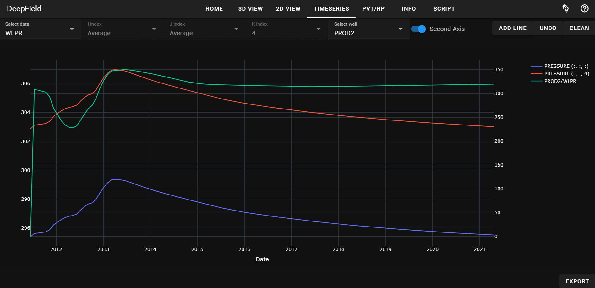
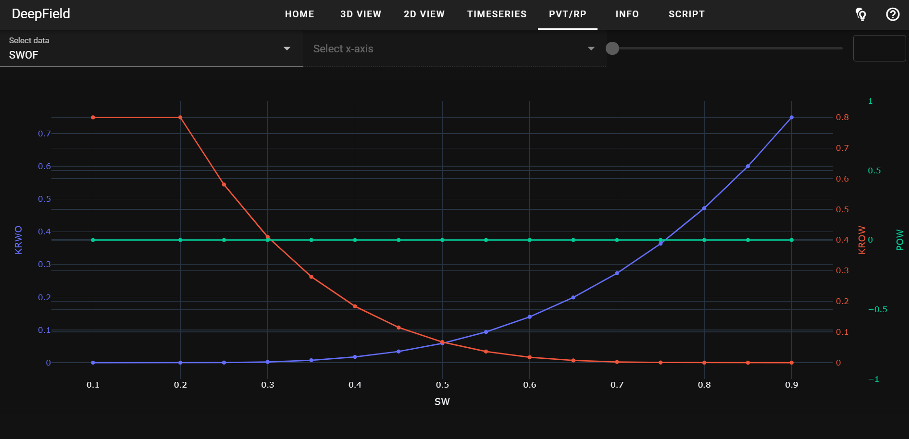
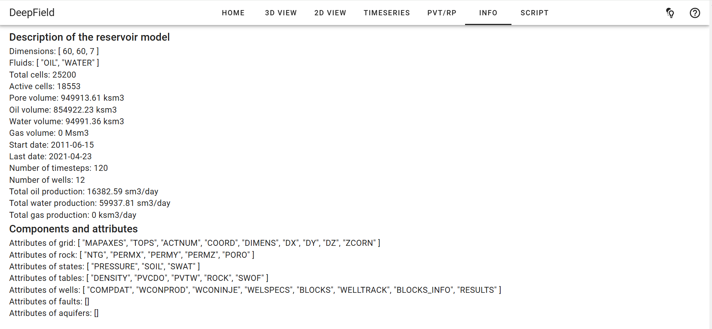
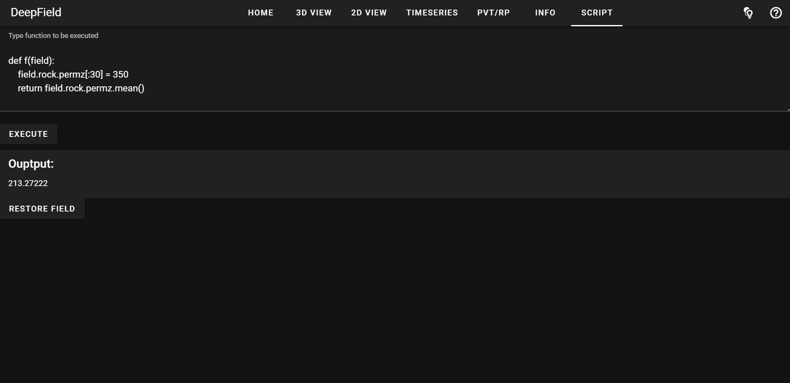
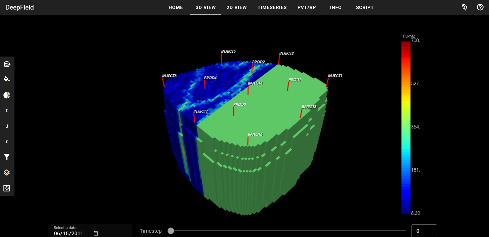

# DeepField-app

Web application for visualization and exploration of reservoir models in 3D, 2D, and 1D.

Lightweight. Modern. Open source.

## Features

The application allows you to read reservoir models in ECLIPSE file format,
view and explore data in 3D, 2D and 1D, write and execute custom python scripts 
containing reservoir model transformations or calculations, 
and immediately view the results of these transformations.

Main page of the application in a dark theme:

An example of a reservoir model in 3D view with a filter applied to scalar values:

2D slice view of the reservoir model and colormap options:

Construction of a multiline 1D plot to compare dynamic properties of grid cells and wells:

Plots obtained from interpolation of PVT or relative permeability tables:

Description of the reservoir model and a white theme of the application:

Script writing

...and the results of its execution:

## Installation

Run in the terminal:

    pip install "git+https://github.com/deepfield-team/DeepField-app.git@setup

## Run the application

After installation, type and run in the terminal:

	deepfield-app

This should open a new tab in your default browser to http://localhost:8080/ with the application's home page.

You can add a few optional parameters to the command line:
* --server - use to prevent a new tab from opening in the browser
* --app - use to launch the application in a separate window rather than in the browser
* --port 1234 - to change the default port 8080 to, e.g., 1234

When the application is running, you can click on the help icon in the upper right corner
to read a brief description of the page. Hover over buttons and icons to see a tooltip
with textual information about them.

## Open-source reservoir models

An example reservoir model with dynamics simulation can be found in the `open_data` directory in the DeepField repository [https://github.com/deepfield-team/DeepField](https://github.com/deepfield-team/DeepField),
as well as links to a number of other open source models.

## Script writing

The application allows you to write and execute python scripts for reservoir model 
transformations and calculations. The script should be based on the DeepField framework 
[https://github.com/deepfield-team/DeepField](https://github.com/deepfield-team/DeepField).
Read the [documentation](https://deepfield-team.github.io/DeepField/) and see
[examples](https://github.com/deepfield-team/DeepField/blob/main/tutorials) in the DeepField repository to prepare a script.