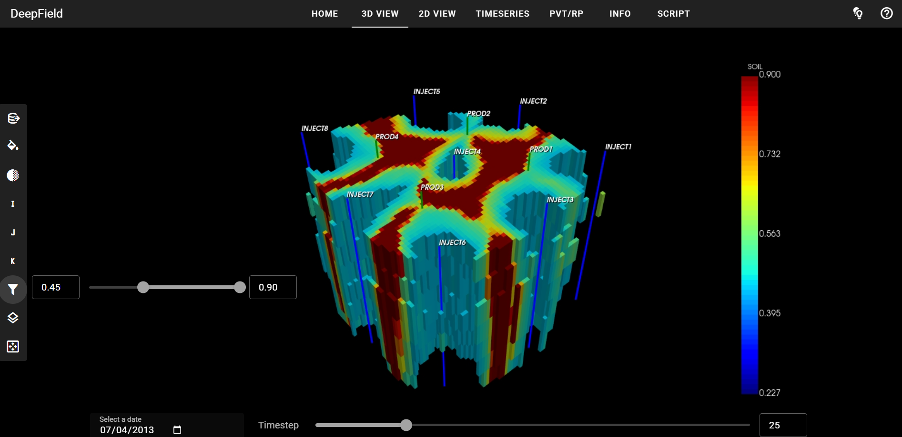
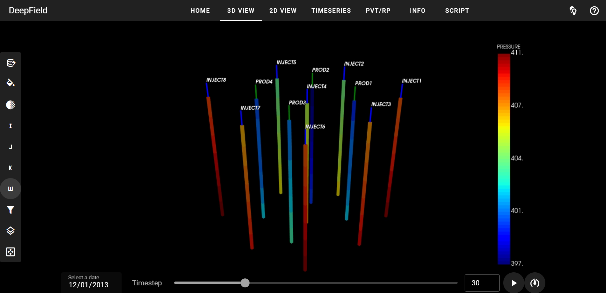

# DeepField-app

Web application for visualization and exploration of reservoir models with millions of grid cells in 3D, 2D, and 1D.

Lightweight. Modern. Open source.

## Features

The application allows you to read reservoir models in ECLIPSE file format,
view and explore data in 3D, 2D and 1D, write and execute custom python scripts 
containing reservoir model transformations or calculations, 
and immediately view the results of these transformations.

Main page of the application:


An example of a reservoir model in 3D view with animation of dynamics:


Indication of well status (producing, injecting, inactive) and filtering of grid cells based on the selected threshold:



Cell picking for properties analysis:


Selection of cells along well trajectories:



2D slice view of the reservoir model and colormap options:


Construction of a multiline 1D plot to compare dynamic properties of grid cells and wells and export data to csv file:


Plots obtained from interpolation of PVT or relative permeability tables:


Description of the reservoir model:


Script writing


...and the results of its execution:


## Performance

Loading time and memory usage for benchmark models in the [benchmarks](https://github.com/deepfield-team/DeepField-app/benchmarks) directory measured on a PC with Intel Core Ultra 7, 3.9GHz, 64Gb CPU:

| Number of cells | Loading time | Memory usage |
|-------|---------|---------|
| 1M | 23s | 0.5Gb |
| 10M | 3m 49s | 2.6Gb |
| 50M | 19m 26s | 10.3Gb |

## Installation as a package

We recommend creating a new virtual environment with python 3.11 to install the project dependencies:

	conda create -n app python=3.11

Activate the new environment:

	conda activate app

To install the project dependencies, run in the terminal:

    pip install "git+https://github.com/deepfield-team/DeepField-app.git"

After installation, run in the terminal:

	deepfield-app

This should open a new tab in your default browser to http://localhost:8080/ with the application's home page.

You can add a few optional parameters to the application start command:
* --server - use to prevent a new tab from opening in the browser
* --app - use to launch the application in a separate window rather than in the browser
* --port 1234 - to change the default port 8080 to, e.g., 1234

When the application is running, you can click on the help icon in
the upper right corner to read a brief description of the page. 
Hover over buttons and icons to see a tooltip with textual information
about them.

## Installation from source code

Another option to run the application is to clone the entire repository:

	git clone https://github.com/deepfield-team/DeepField-app.git

Addionally, you will need to clone the repository `DeepField` into the same directory as the `DeepField-app`:

	git clone https://github.com/deepfield-team/DeepField.git

Install dependencties in both repositories using

	pip install -r requirements.txt

Then navigate to the directory DeepField-app and run in the terminal

	python -m deepfield_app.app

to start the application.

## Rendering options

By default, rendering is performed locally in the user's browser using vtk webassembly functionality.
To enable vtk remote rendering, use the `-vr` or `--vtk_remote` option when starting the application. 
Note that the functionality of the application is slightly different between local and remote rendering.

## Open-source reservoir models

An example reservoir model with dynamics simulation can be found in the `open_data` directory in the `DeepField` repository [https://github.com/deepfield-team/DeepField](https://github.com/deepfield-team/DeepField),
as well as links to a number of other open source models.

## Script writing

The application allows you to write and execute python scripts for
reservoir model transformations and calculations. The script should 
be based on the `DeepField` framework 
[https://github.com/deepfield-team/DeepField](https://github.com/deepfield-team/DeepField).
Read the [documentation](https://deepfield-team.github.io/DeepField/)
and see
[examples](https://github.com/deepfield-team/DeepField/blob/main/tutorials) 
in the `DeepField` repository to prepare a script.

## Next releases

The project is developing. We are preparing new releases with new features.
Your suggestions and issues reports will help to make the application even better.

## What's inside

We use
* [trame](https://github.com/Kitware/trame) to build the web application
* [DeepField](https://github.com/deepfield-team/DeepField) to read and process reservoir models

## Citing

We hope that this project will help you in your research and you will decide to cite it as
```
DeepField web application (2024). GitHub repository, https://github.com/deepfield-team/DeepField-app.
```
